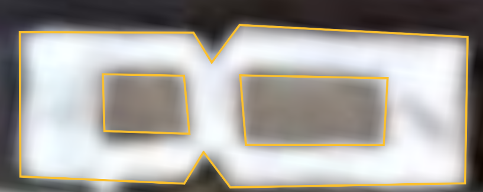
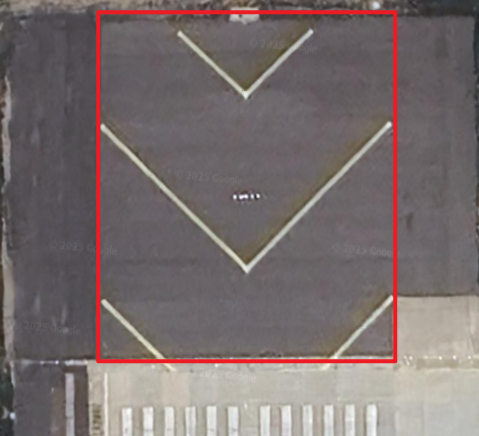

# Flyatcsim EuroScope 地面扇区 征集计划

## 一、计划简介

Flyatcsim 付费扇区由 Flyatcsim Sector Studio（以下简称“本工作室”）独立研发。然而，受限于精力与时间，我们现正式启动 **“EuroScope 地面扇区征集计划”**，诚邀广大爱好者与开发者参与其中

在本计划中，您可自主制作并提交 EuroScope 地面扇区成果，经审核后，本工作室将择优收录至后续版本的正式扇区产品中。这一机制与 **Steam 创意工坊** 类似，具体的版权归属与报酬机制见第二章说明

## 二、版权与报酬说明

1. **版权归属**
    根据《中华人民共和国著作权法》第二十五条相关规定，您在提交作品前，应先向本工作室提供明确报价（亦可选择无偿）
    一旦提交并经本工作室采纳，您提供的 **EuroScope 地面扇区及其相关附属文件的全部著作权将归本工作室所有**
2. **使用限制**
    未经本工作室许可，您不得以任何形式将该作品或其衍生内容对外传播，亦不得实施任何可能损害本工作室利益的行为
3. **报酬机制**
   - 如选择有偿提交，本工作室将在确认收录后，依据协商的报价支付报酬
   - 如选择无偿提交，本工作室将以署名致谢等形式予以认可

## 三、联系方式

如有意参与本计划，您可通过以下方式与我们联系：

- **电子邮件**：Flyatcsimsector@163.com
- **QQ**：3376456371
- **Github仓库**：https://github.com/Flyatcsim-Sector-Studio/EuroScope-Ground-Sector-Collection/issues/new?template=kml_commit.yml

## 四、参与流程

### 4.1 前期准备

- 一台可进行国际联网的电脑

---

### 4.2 确定区域

您可以在以下的列表中查看已完成的地面扇区：

- [ ] ZBAA-北京/首都（制作中）
- [ ] ZBAD-北京/大兴
- [ ] ZBDS-鄂尔多斯/伊金霍洛
- [ ] ZBDT-大同/云冈
- [ ] ZBER-二连浩特/赛乌素
- [ ] ZBHH-呼和浩特/白塔
- [ ] ZBLA-呼伦贝尔/海拉尔
- [ ] ZBMZ-满洲里/西郊
- [ ] ZBOW-包头/东河
- [ ] ZBSJ-石家庄/正定
- [ ] ZBTJ-天津/滨海
- [ ] ZBYC-运城/盐湖
- [ ] ZBYN-太原/武宿
- [ ] ZGDY-张家界/荷花
- [ ] ZGGG-广州/白云
- [ ] ZGHA-长沙/黄花
- [ ] ZGKL-桂林/两江
- [ ] ZGNN-南宁/吴圩
- [ ] ZGOW-揭阳/潮汕
- [ ] ZGSZ-深圳/宝安
- [ ] ZGZJ-湛江/吴川
- [ ] ZHCC-郑州/新郑
- [ ] ZHEC-鄂州/花湖
- [ ] ZHES-恩施/许家坪
- [ ] ZHHH-武汉/天河
- [ ] ZHYC-宜昌/三峡
- [ ] ZJHK-海口/美兰
- [ ] ZJQH-琼海/博鳌
- [ ] ZJSY-三亚/凤凰
- [ ] ZLDH-敦煌/莫高
- [ ] ZLIC-银川/河东
- [ ] ZLLL-兰州/中川
- [ ] ZLXN-西宁/曹家堡
- [ ] ZLXY-西安/咸阳
- [ ] ZPJH-西双版纳/嘎洒
- [ ] ZPLJ-丽江/三义
- [ ] ZPMS-德宏/芒市
- [ ] ZPPP-昆明/长水
- [x] ZSAM-厦门/高崎
- [ ] ZSCG-常州/奔牛
- [ ] ZSCN-南昌/昌北
- [ ] ZSFZ-福州/长乐
- [ ] ZSHC-杭州/萧山
- [ ] ZSJN-济南/遥墙
- [ ] ZSLG-连云港/花果山
- [ ] ZSLY-临沂/启阳
- [ ] ZSNB-宁波/栎社
- [ ] ZSNJ-南京/禄口
- [ ] ZSNT-南通/兴东
- [ ] ZSOF-合肥/新桥
- [x] ZSPD-上海/浦东
- [ ] ZSQD-青岛/胶东
- [ ] ZSQZ-泉州/晋江
- [ ] ZSSH-淮安/涟水
- [x] ZSSS-上海/虹桥
- [ ] ZSTX-黄山/屯溪
- [ ] ZSWH-威海/大水泊
- [ ] ZSWX-无锡/硕放
- [ ] ZSWZ-温州/龙湾
- [ ] ZSXZ-徐州/观音
- [ ] ZSYA-扬州/泰州
- [ ] ZSYN-盐城/南洋
- [ ] ZSYT-烟台/蓬莱
- [ ] ZSYW-义乌
- [ ] ZSZS-舟山/普陀山
- [ ] ZUCK-重庆/江北
- [ ] ZUGY-贵阳/龙洞堡
- [ ] ZULS-拉萨/贡嘎
- [ ] ZUTF-成都/天府
- [ ] ZUUU-成都/双流
- [ ] ZUXC-西昌/青山
- [ ] ZWSH-喀什/徕宁
- [ ] ZWTN-和田/昆冈
- [ ] ZWWW-乌鲁木齐/天山
- [ ] ZYCC-长春/龙嘉
- [ ] ZYHB-哈尔滨/太平
- [ ] ZYJM-佳木斯
- [ ] ZYMD-牡丹江/海浪
- [ ] ZYQQ-齐齐哈尔/三家子
- [ ] ZYTL-大连/周水子
- [ ] ZYTX-沈阳/桃仙
- [x] ZYYJ-延吉/朝阳川

> [!NOTE]
>
> 此列表将不定时更新，最新数据详见：
>
> [https://github.com/Flyatcsim-Sector-Studio/EuroScope-Ground-Sector-Collection/issues/1](https://github.com/Flyatcsim-Sector-Studio/EuroScope-Ground-Sector-Collection/issues/1)

您可以随意挑选一个未打钩的机场进行制作。您可开启一个issue或告知我们，我们在列表中显示“制作中”，以避免重复制作

---

### 4.3 具体操作步骤

#### 4.3.1 准备工作

1. 打开浏览器（推荐使用Google Chrome），在网址栏输入：[https://earth.google.com/web/](https://earth.google.com/web/)
2. 新建项目或按Ctrl + J，将“无标题项目”改为机场的ICAO，例如：ZBAA
3. 在“搜索Google 地球”中，可输入机场ICAO，例如：ZBAA，视野将会自动跳转至该机场

> [!NOTE]
>
> 在制作小机场的地面扇时，由于Google Earth数据可能产生偏移/过期，我们强烈推荐使用EAIP AD中的机场基准点坐标搜索，下面以ZBAA机场为例：
>
> | ZBAA AD 2.2 机场地理位置和管理资料 Aerodrome geographical and administrative data |                                                              |                                            |
> | :----------------------------------------------------------- | ------------------------------------------------------------ | ------------------------------------------ |
> | 1                                                            | 机场基准点坐标及其在机场的位置 ARP coordinates and site at AD | N40°04.4′ E116°35.9′ Center of RWY 18L/36R |
>
> 在Google Earth搜索框中输入“N40°04.4′ E116°35.9′ ”，也可跳转至该机场

#### 4.3.2 跑道白色标志的制作

跑道标志是跑道不可或缺的一部分，任何在跑道范围内出现的白色填充物，都属于跑道标志的部分，这包括：跑道上的虚线、数字（跑道编号）、斑马线（跑道入口标识）、大白块（瞄点标识）、白块（接地带标识）、白色包围线（跑道边线）、白色箭头（跑道入口内移标识）

---

在Google Earth中，右上角点击并勾勒出跑道标志外轮廓，并使得图形封闭

这样，一个跑道标志就勾勒完成，点击以保存，更改“未命名的多边形”，以“RunwayMark”命名并保存

##### 4.3.2.1 跑道白色标志特殊情况的处理

有时在制作跑道上的数字时，发现其内部有黑色填充，并非为纯白色填充。

解决方案：

将数字外轮廓勾出后，再次勾出内部黑色，将其命名为“RunwayBorder”，例如这样：

---

至此，跑道标志制作完成

#### 4.3.3 停止道标识的制作

停止道是跑道头尾区域有黄色箭头标识的用于紧急情况让飞机停下来的区域，通常材料柔软，例如：

按照[4.3.2](#4.3.2 跑道白色标志的制作)同理，勾外轮廓即可

---

## 五、提交成品

至此，一条跑道的标识就做好了，接下来只需要以此类推把所有跑道标识做好就可以向我们提交了

提交文件仅支持`机场ICAO.kml`

推荐在：https://github.com/Flyatcsim-Sector-Studio/EuroScope-Ground-Sector-Collection/issues/new?template=kml_commit.yml，提交
